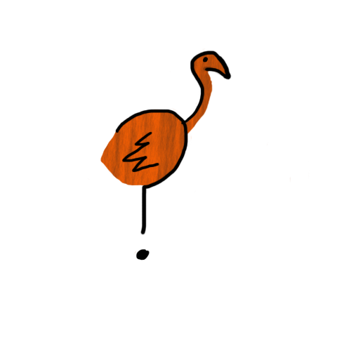

# OSTRIDGE ?

    O S T R I D G E ?
    p y h u s a o h   
    e s r s   m 0  
    r t o t   n d 
    a e u 
    t m g
    i   h
    n
    g

## Tools
First you will need rust, so download and install it [here](https://www.rust-lang.org/en-US/install.html)

We will need to use the nightly unstable version of the compiler, so once you have installed rust, use:

`rustup override add nightly`

#### Qemu
`sudo apt-get install qemu`

### Packages
`cargo install cargo-xbuild`

`cargo install bootimage --version "^0.5.0"`

You should be able to run the OS using `bootimage run`
Unit tests can be run using `cargo test`
Integration tests can be run using `bootimage test`
To allow QEMU to print to the serial port, use `bootimage run -- -serial mon:stdio`